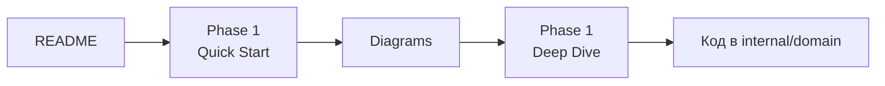

# 📚 PayBridge Documentation

Добро пожаловать в документацию PayBridge - платёжного шлюза, построенного на принципах Clean Architecture и Domain-Driven Design.

## 🚀 С чего начать?

### Я хочу...

#### ...быстро понять проект (5 минут)
👉 Читай [README.md](../README.md) в корне проекта

#### ...решить срочную проблему (5 минут) 🔥
👉 Открой [QUICK_SOLUTIONS.md](QUICK_SOLUTIONS.md)
- Транзакция задублировалась?
- Race condition на балансе?
- API упал?
- **Быстрые ответы с кодом!**

#### ...изучить архитектуру (2 часа)
👉 Следуй Quick Start гайдам:
1. [Phase 1: Domain Layer](QUICK_START.md) - 15 мин
2. [Phase 2: Application Layer](PHASE_2_QUICK_START.md) - 20 мин  
3. [Phase 3: Infrastructure](PHASE_3_QUICK_START.md) - 30 мин
4. [Diagrams](DIAGRAMS.md) - 15 мин

#### ...глубоко разобраться (5-6 часов)
👉 Читай Deep Dive серию:
1. [DEEP_DIVE_RU.md](DEEP_DIVE_RU.md) - Domain Layer
2. [DEEP_DIVE_PHASE2_RU.md](DEEP_DIVE_PHASE2_RU.md) - Application Layer
3. [DEEP_DIVE_PHASE3_RU.md](DEEP_DIVE_PHASE3_RU.md) - Infrastructure

#### ...найти решение конкретной проблемы (30 мин)
👉 Открой [COMMON_PROBLEMS_SOLUTIONS.md](COMMON_PROBLEMS_SOLUTIONS.md)
- 10 категорий типичных проблем
- Множество подходов с примерами
- Плюсы/минусы каждого решения

---

## 📖 Структура документации

```
docs/
│
├── 🎯 Quick Start Guides (15-30 мин каждый)
│   ├── QUICK_START.md              # Phase 1: Domain Layer
│   ├── PHASE_2_QUICK_START.md      # Phase 2: Application Layer
│   └── PHASE_3_QUICK_START.md      # Phase 3: Infrastructure
│
├── 📚 Deep Dive Guides (45-90 мин каждый)
│   ├── DEEP_DIVE_RU.md             # Phase 1 детально
│   ├── DEEP_DIVE_PHASE2_RU.md      # Phase 2 детально
│   └── DEEP_DIVE_PHASE3_RU.md      # Phase 3 детально
│
├── 📊 Summaries (10-20 мин каждый)
│   ├── PHASE_1_SUMMARY.md          # Краткое резюме Phase 1
│   ├── PHASE_2_SUMMARY.md          # Краткое резюме Phase 2
│   └── PHASE_3_SUMMARY.md          # Краткое резюме Phase 3
│
├── 🔥 Problem Solving (5-90 мин)
│   ├── QUICK_SOLUTIONS.md          # Шпаргалка - 5 мин ⚡
│   └── COMMON_PROBLEMS_SOLUTIONS.md # Детальный гид - 60 мин
│
├── 🎨 Visual & Reference
│   ├── DIAGRAMS.md                 # Все диаграммы архитектуры
│   ├── PHASES_COMPARISON.md        # Сравнение всех фаз
│   └── PHASE_3_PATTERNS_CHEATSHEET.md # Быстрая справка
│
├── 🏛️ Architecture Decisions
│   └── adr/
│       └── 001-domain-layer-design.md
│
├── 🔒 Security Guides
│   ├── SECURITY_GUIDELINES.md
│   ├── SECURITY_CODE_EXAMPLES.md
│   ├── SECURITY_IMPLEMENTATION_COMPLETE.md
│   ├── SECURITY_QUICK_START.md
│   └── security-audit.md
│
└── 📑 Meta
    ├── INDEX.md                     # Полный индекс документации
    └── README.md                    # Этот файл
```

---

## 🎯 Learning Paths

### 🟢 Новичок в DDD (2-3 часа)



1. [README.md](../README.md) - 5 мин
2. [Phase 1 Quick Start](QUICK_START.md) - 15 мин
3. [Diagrams](DIAGRAMS.md) - 15 мин
4. [Phase 1 Deep Dive](DEEP_DIVE_RU.md) - 45 мин
5. Изучи код в `internal/domain/`

### 🟡 Изучаю Application Layer (3 часа)

1. [Phase 2 Quick Start](PHASE_2_QUICK_START.md) - 20 мин
2. [Phase 2 Deep Dive](DEEP_DIVE_PHASE2_RU.md) - 60 мин
3. [Diagrams](DIAGRAMS.md) - Sequence диаграммы
4. Код в `internal/application/`

### 🟠 Разбираюсь с Infrastructure (4 часа)

1. [Phase 3 Quick Start](PHASE_3_QUICK_START.md) - 30 мин
2. [Phase 3 Patterns Cheatsheet](PHASE_3_PATTERNS_CHEATSHEET.md) - 15 мин
3. [Phase 3 Deep Dive](DEEP_DIVE_PHASE3_RU.md) - 90 мин
4. Код в `internal/infrastructure/`

### 🔴 Решаю проблемы (1-2 часа)

1. [Quick Solutions](QUICK_SOLUTIONS.md) - 5 мин (шпаргалка)
2. [Common Problems](COMMON_PROBLEMS_SOLUTIONS.md) - 60 мин (детальный гид)
3. Применяю на практике

### ⚫ Понимаю общую картину (1 час)

1. [Phases Comparison](PHASES_COMPARISON.md) - 20 мин
2. [Diagrams](DIAGRAMS.md) - 20 мин
3. Все Summary документы - 20 мин

---

## 🔍 Навигация по темам

### DDD & Clean Architecture
- [Domain Layer Design ADR](adr/001-domain-layer-design.md)
- [Entities vs Value Objects](DEEP_DIVE_RU.md#entities-vs-value-objects)
- [Aggregates](DEEP_DIVE_RU.md#aggregates)
- [Domain Events](DEEP_DIVE_RU.md#domain-events)
- [Hexagonal Architecture](DEEP_DIVE_PHASE2_RU.md#hexagonal-architecture)

### Паттерны
- [Repository Pattern](PHASE_3_PATTERNS_CHEATSHEET.md#repository-pattern)
- [Unit of Work](PHASE_3_PATTERNS_CHEATSHEET.md#unit-of-work)
- [Optimistic Locking](PHASE_3_PATTERNS_CHEATSHEET.md#optimistic-locking)
- [Transactional Outbox](PHASE_3_PATTERNS_CHEATSHEET.md#transactional-outbox)
- [CQRS](DEEP_DIVE_PHASE2_RU.md#cqrs)

### Решение проблем
- [Консистентность данных](COMMON_PROBLEMS_SOLUTIONS.md#1-консистентность-данных)
- [Распределенные транзакции](COMMON_PROBLEMS_SOLUTIONS.md#2-распределенные-транзакции)
- [Race Conditions](COMMON_PROBLEMS_SOLUTIONS.md#3-race-conditions-и-конкурентность)
- [Идемпотентность](COMMON_PROBLEMS_SOLUTIONS.md#4-идемпотентность-операций)
- [Обработка сбоев](COMMON_PROBLEMS_SOLUTIONS.md#5-обработка-сбоев-и-ретраи)
- [Масштабирование](COMMON_PROBLEMS_SOLUTIONS.md#6-масштабирование-и-производительность)
- [Безопасность](COMMON_PROBLEMS_SOLUTIONS.md#7-безопасность-финансовых-операций)
- [Мониторинг](COMMON_PROBLEMS_SOLUTIONS.md#10-мониторинг-и-алертинг)

### Безопасность
- [Security Guidelines](SECURITY_GUIDELINES.md)
- [Security Code Examples](SECURITY_CODE_EXAMPLES.md)
- [Security Quick Start](SECURITY_QUICK_START.md)

---

## 💡 Советы по чтению

### Для нетерпеливых ⚡
1. [README.md](../README.md) 
2. [QUICK_SOLUTIONS.md](QUICK_SOLUTIONS.md)
3. Код в `internal/`
4. Возвращайтесь к Deep Dive по мере необходимости

### Для основательных 📚
1. Читайте последовательно: Phase 1 → 2 → 3
2. Для каждой фазы: Quick Start → Deep Dive → Summary
3. Экспериментируйте с кодом параллельно
4. Изучайте диаграммы для визуализации

### Для практиков 🔧
1. [Phase 3 Patterns Cheatsheet](PHASE_3_PATTERNS_CHEATSHEET.md)
2. [QUICK_SOLUTIONS.md](QUICK_SOLUTIONS.md)
3. Примеры кода из `internal/`
4. Тесты в `*_test.go`

---

## 🆘 Где искать помощь?

### Проблема при разработке?
👉 [QUICK_SOLUTIONS.md](QUICK_SOLUTIONS.md) - мгновенные ответы

### Не понимаю паттерн?
👉 [PHASE_3_PATTERNS_CHEATSHEET.md](PHASE_3_PATTERNS_CHEATSHEET.md)

### Нужен детальный разбор?
👉 [COMMON_PROBLEMS_SOLUTIONS.md](COMMON_PROBLEMS_SOLUTIONS.md)

### Хочу увидеть визуально?
👉 [DIAGRAMS.md](DIAGRAMS.md)

### Нужна общая картина?
👉 [PHASES_COMPARISON.md](PHASES_COMPARISON.md)

### Не знаю с чего начать?
👉 [INDEX.md](INDEX.md) - полный индекс

---

## 📝 Форматы документов

| Тип | Время | Описание | Пример |
|-----|-------|----------|--------|
| **Quick Start** | 15-30 мин | Практический туториал | [QUICK_START.md](QUICK_START.md) |
| **Deep Dive** | 45-90 мин | Детальное объяснение теории | [DEEP_DIVE_RU.md](DEEP_DIVE_RU.md) |
| **Summary** | 10-20 мин | Краткое резюме | [PHASE_1_SUMMARY.md](PHASE_1_SUMMARY.md) |
| **Cheatsheet** | 5-15 мин | Быстрая справка | [QUICK_SOLUTIONS.md](QUICK_SOLUTIONS.md) |
| **Diagrams** | Визуально | Схемы и диаграммы | [DIAGRAMS.md](DIAGRAMS.md) |
| **ADR** | 10-20 мин | Architectureрешения | [adr/](adr/) |

---

## 🎓 Что дальше?

После изучения документации:

1. **Практика**: Реализуй новый use case
2. **Тесты**: Напиши integration тесты
3. **Эксперименты**: Попробуй альтернативные паттерны
4. **Contribution**: Улучши код или документацию

---

## 🌟 Лучшие документы для начала

### Top 3 для новичков
1. [README.md](../README.md) - Обзор проекта
2. [QUICK_START.md](QUICK_START.md) - Domain Layer
3. [DIAGRAMS.md](DIAGRAMS.md) - Визуализация

### Top 3 для практиков
1. [QUICK_SOLUTIONS.md](QUICK_SOLUTIONS.md) - Шпаргалка
2. [PHASE_3_PATTERNS_CHEATSHEET.md](PHASE_3_PATTERNS_CHEATSHEET.md) - Паттерны
3. [COMMON_PROBLEMS_SOLUTIONS.md](COMMON_PROBLEMS_SOLUTIONS.md) - Решения проблем

### Top 3 для архитекторов
1. [PHASES_COMPARISON.md](PHASES_COMPARISON.md) - Сравнение подходов  
2. [DEEP_DIVE_RU.md](DEEP_DIVE_RU.md) - DDD паттерны
3. [adr/001-domain-layer-design.md](adr/001-domain-layer-design.md) - Решения

---

## 📊 Статистика документации

- **Всего документов**: 25+
- **Общее время чтения**: ~10-15 часов (полное изучение)
- **Примеров кода**: 100+ фрагментов
- **Диаграмм**: 12 Mermaid диаграмм
- **Языки**: Русский (основной), English (код)

---

**Happy Learning! 🚀**

*Если нашли ошибку или хотите что-то улучшить - welcome to contribute!*
